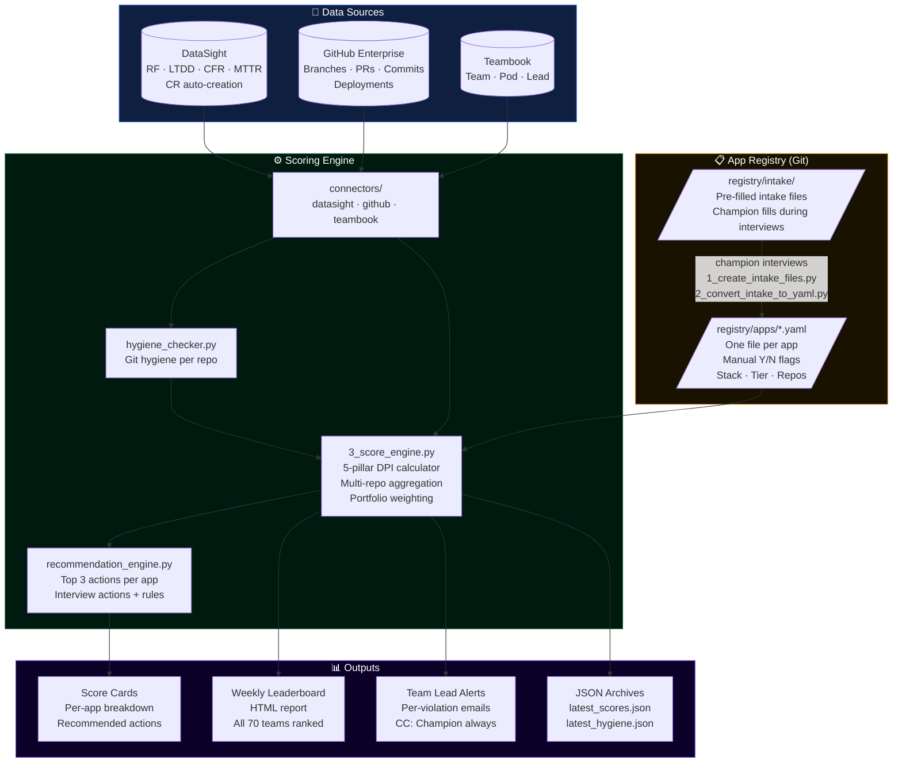
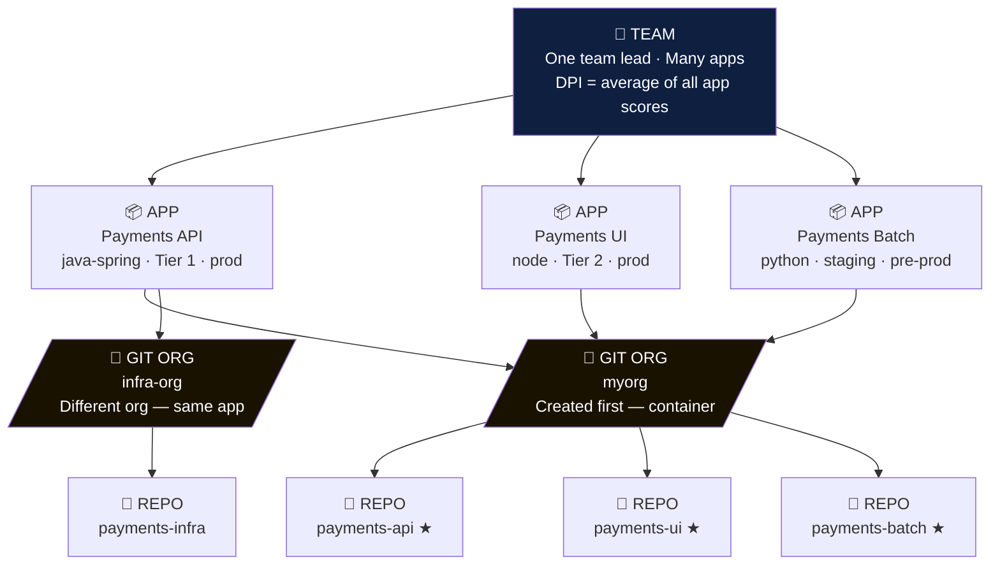
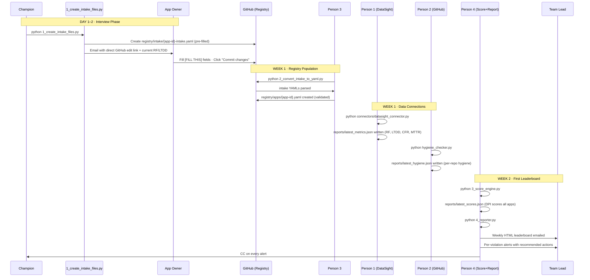
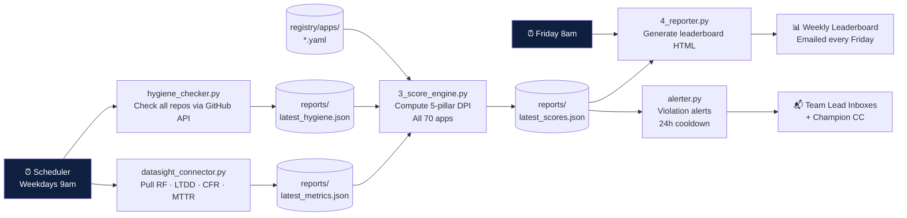
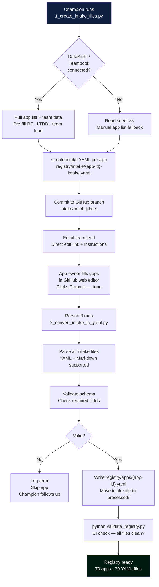
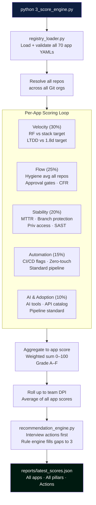
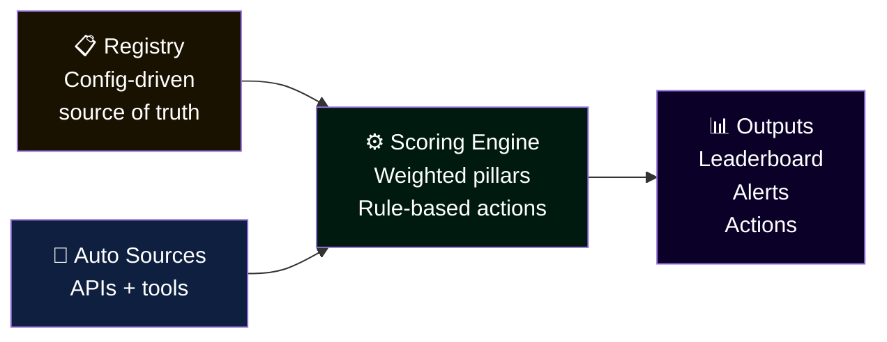

# DevOps Transformation Platform — Architecture Design Document

> **Audience:** This document is written for two audiences simultaneously.
> The [Executive Summary](#executive-summary) and [Platform Vision](#platform-vision) sections are non-technical and suitable for leadership presentations.
> Everything from [System Architecture](#system-architecture) onwards is the technical reference for the engineering team.

---

## Table of Contents

1. [Executive Summary](#executive-summary)
2. [Platform Vision](#platform-vision)
3. [System Architecture](#system-architecture)
4. [Entity Hierarchy](#entity-hierarchy)
5. [Data Flow](#data-flow)
6. [Execution Sequence](#execution-sequence)
7. [Component Responsibilities](#component-responsibilities)
8. [Scoring Model](#scoring-model)
9. [Extensibility Design](#extensibility-design)
10. [Operational Runbook](#operational-runbook)
11. [Applying This to Other Initiatives](#applying-this-to-other-initiatives)

---

## Executive Summary

The **DevOps Transformation Platform** is an automated intelligence and engagement system that measures, scores, and publicly ranks 70 application teams on a weekly basis across five dimensions: delivery velocity, engineering flow, system stability, pipeline automation, and AI adoption. Scores are computed automatically from existing tools — DataSight, GitHub, and Teambook — with no manual reporting by any team.

The platform introduces a **league-based gamification system** with badges, sprint challenges, and weekly rivalry mechanics to drive healthy competition. Every team receives a personalised score card with their top three improvement actions, calibrated to their stack type and current state. The target: grow the service line's collective release frequency from 40 to 280 releases per month by December 2026, while reducing lead time to deploy from 8 days to 1.8 days.

> **Investment required:** 3–4 engineers for a 4-week build sprint. First leaderboard published in Week 2. Platform is self-sustaining after launch with one part-time maintainer.

---

## Platform Vision

### The Problem This Solves

| Symptom | Root Cause | Platform Response |
|---------|-----------|-------------------|
| Low release frequency (40/month) | Large batches, fear of releasing, manual gates | Velocity scoring + batch size tracking |
| Long lead time (8 days) | Approval bottlenecks, manual pipeline steps | Flow scoring + approval gate count metric |
| No visibility across 70 teams | No central measurement, no shared language | Weekly automated leaderboard |
| Inconsistent practices | No standard to measure against | Registry flags + standard pipeline scoring |
| No motivation to improve | No recognition, no competition | League system + badges + sprint challenges |

### Design Principles

- **Automated first.** If a metric requires a human to compile it, it degrades within weeks.
- **Transparent by default.** Every team sees every team's score. Accountability is public.
- **Fair, not uniform.** Legacy and vendor apps are not measured against modern cloud-native targets.
- **Engagement over compliance.** The platform creates incentive through competition, not mandates alone.
- **Extensible by config.** New metrics are added via a YAML file — no code changes required.

---

## System Architecture

### High-Level Overview



### Technology Stack

| Layer | Technology | Rationale |
|-------|-----------|-----------|
| Language | Python 3.11+ | Universal, readable, fast to build |
| Data sources | REST APIs (DataSight, GitHub, Teambook) | All existing tools — no new infrastructure |
| Registry | YAML files in Git | Version-controlled, PR-gated, no database needed |
| Scheduling | `schedule` library or Jenkins cron | Runs on existing CI infrastructure |
| Output | HTML + JSON | HTML for humans, JSON for downstream tooling |
| Config | YAML | Human-readable, no code change to extend |

---

## Entity Hierarchy

The platform's data model has four levels. Understanding this is essential before touching the code.



**Key rules:**
- A **Git Org** is created first. It is the container. Repos live inside it.
- One **App** can reference repos from **multiple Git orgs** (legacy migration scenario).
- Exactly **one repo per app** is marked `is_primary: true` — this drives LTDD measurement.
- **Release frequency** is summed across all repos of an app.
- **Git hygiene** is averaged across all repos of an app.
- **App scores** are averaged to produce the **Team DPI**.

---

## Data Flow

### Step-by-Step Data Movement



### Weekly Automated Flow (After Launch)



---

## Execution Sequence

### Registry Intake (Champion + Person 3)



### Scoring Engine (Person 4)



---

## Component Responsibilities

### Script Directory

| Script | Owner | Input | Output | Runs When |
|--------|-------|-------|--------|-----------|
| `1_create_intake_files.py` | Champion / P3 | DataSight + Teambook + seed.csv | intake YAMLs in GitHub + emails | Once before interviews |
| `2_convert_intake_to_yaml.py` | Person 3 | `registry/intake/*.yaml` | `registry/apps/*.yaml` | After each interview batch |
| `validate_registry.py` | Person 3 | `registry/apps/*.yaml` | Pass/fail + error list | On every PR to registry |
| `registry_loader.py` | Library | `registry/apps/*.yaml` | `AppEntry` objects | Imported by score engine |
| `connectors/datasight_connector.py` | Person 1 | DataSight API | `reports/latest_metrics.json` | Daily (automated) |
| `connectors/teambook_connector.py` | Person 1 | Teambook API | `reports/latest_teams.json` | Daily (automated) |
| `connectors/github_connector.py` | Person 2 | GitHub Enterprise API | Used by hygiene_checker | Library |
| `hygiene_checker.py` | Person 2 | GitHub API via connector | `reports/latest_hygiene.json` | Daily (automated) |
| `3_score_engine.py` | Person 4 | metrics + hygiene + registry | `reports/latest_scores.json` | Daily (after connectors) |
| `recommendation_engine.py` | Person 4 | scores + registry | Actions per app | Called by score engine |
| `4_reporter.py` | Person 4 | `latest_scores.json` + hygiene | `reports/weekly_*.html` | Every Friday |

### Config Files

| File | Purpose | Who Edits |
|------|---------|-----------|
| `config/settings.yaml` | All URLs, tokens, weights, targets | Champion (initial setup) |
| `config/recommendation_rules.yaml` | Rule engine rules | Champion (add new rules anytime) |
| `registry/apps/*.yaml` | One per app — source of truth | Team leads (via PR) |
| `registry/intake/seed.csv` | Bootstrap app list before APIs connect | Person 3 |

---

## Scoring Model

### DPI Pillars

| Pillar | Weight | Primary Source | Key Metrics |
|--------|--------|---------------|-------------|
| **Velocity** | 30% | DataSight | RF vs target · LTDD vs 1.8d · Batch size |
| **Flow** | 25% | GitHub + DataSight | Git hygiene · PR SLA · Approval gates · CFR |
| **Stability** | 20% | DataSight + Registry | MTTR · Branch protection · Priv access · SAST |
| **Automation** | 15% | Registry | CI/CD automated · Standard pipeline · Zero-touch |
| **AI & Adoption** | 10% | Registry | AI tools · API catalog · Pipeline standard |

### Stack-Adjusted RF Targets

| Stack Type | RF Target (per app/month) | Notes |
|-----------|--------------------------|-------|
| Modern / Cloud-Native | 10 | Full CI/CD · Feature flags · Zero-touch possible |
| Traditional / On-Prem | 5 | CI possible · CD in progress |
| Legacy / Stabilised | 1.5 | Patches + config releases count |
| Vendor / iSeries | **Excluded** | RF not a lever · Scored on 4 pillars only |

### Score Grade Thresholds

| Grade | DPI Score | League |
|-------|-----------|--------|
| A | 85–100 | 🏆 Elite |
| B | 70–84 | 🚀 Pro |
| C | 55–69 | 🔧 Builder (upper) |
| D | 40–54 | 🔧 Builder (lower) |
| F | < 40 | 🌱 Foundation |

---

## Extensibility Design

This is the most important architectural decision in the platform. **Adding a new metric never requires a Python code change.**

### How to Add a New Scoring Rule

Open `config/recommendation_rules.yaml` and add:

```yaml
- id: your_new_rule_id
  condition: "pipeline_flags.new_flag == false"
  action: "Short action title for the team"
  detail: "2–3 sentence specific guidance on what to do and how."
  pillar: Automation          # Which DPI pillar this improves
  points_gain: 3              # Estimated DPI points gained
  effort: medium              # low | medium | high
  skip_for_app_types: [vendor]  # Optional — skip certain stack types
```

Save the file. The next scoring run picks it up. No restart, no code change.

### How to Add a New DataSight Metric to Scoring

1. Confirm the field name in DataSight API
2. Add to `config/settings.yaml` under `datasight.field_map`
3. Add a rule to `recommendation_rules.yaml` that references it
4. Done — appears in next week's scores

### How to Adjust Pillar Weights

In `config/settings.yaml`:

```yaml
scoring:
  weights:
    velocity:    30   # Change these numbers
    flow:        25   # Must sum to 100
    stability:   20
    automation:  15
    ai_adoption: 10
```

### Applying This Architecture to Other Initiatives

The platform's design pattern is reusable for any measurement-and-improvement initiative:



**This same architecture can power:**

| Initiative | Registry holds | Auto sources | Scoring pillars |
|-----------|---------------|--------------|-----------------|
| **API Governance** | API metadata, SLA targets | API gateway metrics | Coverage · Compliance · Performance |
| **Security Posture** | App risk classification | Vulnerability scanners | Vuln count · SAST · Access reviews |
| **Cloud Migration** | Migration status, target arch | AWS/GCP cost tools | Migration % · Cost efficiency · Resiliency |
| **AI Adoption** | Tool declarations, use cases | GitHub Copilot API | Adoption · Usage · Productivity delta |
| **Incident Management** | SLA targets, escalation paths | PagerDuty / ServiceNow | MTTR · SLA compliance · Recurring incidents |

The pattern is: **Registry as spine + API connectors + weighted scoring + config-driven rules + gamified output.**

---

## Operational Runbook

### Weekly Checklist (Champion)

```
Monday
  [ ] Check last_scores.json — any apps with N/A scores (missing registry data)?
  [ ] Review alerts sent last Friday — any team that didn't respond?
  [ ] Chase any zero-RF apps — escalate if persistent

Friday
  [ ] Confirm automated leaderboard ran and was delivered
  [ ] Send personal message to Most Improved team
  [ ] Review any new PRs to registry/apps/ — approve or request changes
  [ ] Announce this week's Sprint Challenge winner (if applicable)
```

### Adding a New App Mid-Programme

```bash
# Person 3:
cp registry/intake/_intake_template.yaml registry/intake/new-app-id-intake.yaml
# Fill in what you know
# Champion: interview the new team lead
python scripts/2_convert_intake_to_yaml.py --app new-app-id
python scripts/validate_registry.py
# Raise PR → Champion approves → app appears in next leaderboard
```

### Rotating a Team Lead

```bash
# Team lead raises PR to update their app YAML:
# registry/apps/{app-id}.yaml
# Change: team_lead_email + release_champion fields
# Champion approves PR
# Alert routing updates automatically on next run
```

### Emergency: Score Looks Wrong for One App

```bash
# 1. Check the registry entry
cat registry/apps/{app-id}.yaml

# 2. Check what metrics DataSight returned
python scripts/connectors/datasight_connector.py --app {app-id}

# 3. Re-run score for just that app
python scripts/3_score_engine.py --app {app-id}

# 4. Check the output
cat reports/latest_scores.json | python -m json.tool | grep -A 50 "{app-id}"
```

---

## Applying This to Other Initiatives

> **For leadership:** This section explains why the platform investment pays dividends beyond DevOps transformation.

The architecture built for this platform — a **config-driven registry + automated connectors + weighted scoring engine + gamified output layer** — is a reusable intelligence framework. Any initiative that needs to:

1. Track the state of many teams or systems against a standard
2. Score performance automatically from existing tool data
3. Surface recommended actions personalised per team
4. Drive improvement through visible competition and recognition

...can be implemented by adding a new registry schema, new connectors, and new scoring weights — without rebuilding the engine.

**The DevOps Transformation Platform is not just a DevOps tool. It is the beginning of a measurement operating system for the service line.**

---

*Document version: 1.0 · March 2026 · DevOps Champion*
*All diagrams rendered by GitHub's native Mermaid support — no plugins required.*
