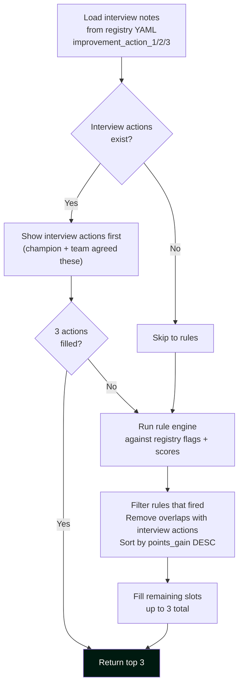

# DPI Scoring Reference

The DevOps Performance Index (DPI) is a 100-point score computed weekly for every app.
This document is the definitive reference for how every point is calculated.

---

## Pillar Weights

```
┌─────────────────────────────────────────────────────────────────┐
│  VELOCITY      FLOW       STABILITY   AUTOMATION   AI & ADOPTION │
│    30%          25%          20%          15%           10%       │
└─────────────────────────────────────────────────────────────────┘
```

Weights are configured in `config/settings.yaml` under `scoring.weights`.
Changing a weight affects all apps on the next scoring run.

---

## Pillar 1 — Velocity (30 pts)

Measures how often the app ships to production and how fast code moves from merge to live.

| Sub-metric | Points within pillar | Source | Notes |
|-----------|---------------------|--------|-------|
| Release Frequency vs target | 50% | DataSight | Scored against stack-adjusted target |
| Lead Time to Deploy (LTDD) vs 1.8d | 35% | DataSight | Linear scale: ≤1.8d = 100%, ≥8d = 0% |
| Deployment trend (improving?) | 15% | DataSight | Week-over-week delta |

### Stack-Adjusted RF Targets

| Stack | Target RF/month | Scoring basis |
|-------|----------------|---------------|
| Modern / Cloud-Native | 10 | Full weight |
| Traditional / On-Prem | 5 | Full weight |
| Legacy / Stabilised | 1.5 | Full weight — focus shifts to LTDD |
| Vendor / iSeries | **0 — EXCLUDED** | Pillar excluded. Score recalculated on 4 pillars = 100 pts. |

**Important:** RF = production deployments only. Pipeline runs to dev/test/staging do not count.
Feature flags are an architectural enabler of more frequent production deploys — not a release event themselves.

---

## Pillar 2 — Flow (25 pts)

Measures how smoothly work moves through the delivery system.

| Sub-metric | Points within pillar | Source | Notes |
|-----------|---------------------|--------|-------|
| Git hygiene score (avg all repos) | 40% | GitHub API | Branch age · PR size · Commit format |
| PR review SLA (< 4h) | 20% | GitHub API | % PRs reviewed within 4 business hours |
| Pipeline duration avg | 20% | DataSight | Target: < 30 min end-to-end |
| Approval gate count | 20% | Registry | 0 gates = 100%, 3+ gates = 0% |

### Git Hygiene Sub-scores

The hygiene score (0–100) per repo is computed from:

| Check | Severity | Score Impact |
|-------|----------|-------------|
| Branch older than 2 days (non-protected) | Warning | −10 |
| Branch older than 6 days | Critical | −20 |
| PR larger than 400 lines | Critical | −20 |
| PR unreviewed > 4h | Warning | −10 |
| PR unreviewed > 12h | Critical | −20 |
| Commit message not Conventional Commits format | Warning | −10 |
| Main/master has no branch protection | Critical | −20 |
| Direct push to main (bypassing PR) | Critical | −20 |

Multiple repos per app are averaged to produce one hygiene score for the app.

---

## Pillar 3 — Stability + Security (20 pts)

Measures resilience, recoverability, and security posture.

| Sub-metric | Points within pillar | Source | Notes |
|-----------|---------------------|--------|-------|
| MTTR (mean time to restore P1/P2) | 30% | DataSight | Target: < 1 hour |
| Change failure rate (CFR) | 20% | DataSight | % deployments causing an incident |
| Branch protection on main/master | 15% | GitHub API | Auto-detected per repo |
| Privileged access reviewed < 90 days | 20% | Registry | `priv_access_reviewed_date` field |
| Release page exists and reachable | 15% | Registry + HTTP | `release_page_url` checked |

**Special rule — Priv access for deploy:**
If `priv_access_for_deploy: true` in registry, the app scores 0 on zero-touch deployment
(Automation pillar) regardless of other flags. This creates a clear incentive to remove
the dependency on elevated access from the deployment path.

---

## Pillar 4 — Automation (15 pts)

Measures how much of the delivery process runs without human intervention.

| Flag | Points | Registry Field |
|------|--------|---------------|
| CI automated | 15 | `pipeline_flags.ci_automated` |
| CD automated | 20 | `pipeline_flags.cd_automated` |
| Standard pipeline adopted | 15 | `pipeline_flags.standard_pipeline_adopted` |
| CR auto-creation in ServiceNow | 15 | `pipeline_flags.cr_auto_creation` |
| Zero-touch deployment | 20 | `pipeline_flags.zero_touch_deployment` |
| Automated rollback | 15 | `pipeline_flags.automated_rollback` |

All flags are binary (Y/N). Each flip from false → true = immediate measurable score gain.
This is by design — teams should see a clear, instant reward for enabling each capability.

---

## Pillar 5 — AI & Adoption (10 pts)

Measures forward-looking tooling adoption. Positioned as a fast-track accelerator.

| Sub-metric | Points within pillar | Source |
|-----------|---------------------|--------|
| AI coding agent adopted | 40% | Registry |
| API catalog published | 30% | Registry + HTTP |
| Pipeline on standard v2+ | 30% | Registry |

This pillar has the smallest weight (10%) to avoid distorting overall rankings,
but is visible on the leaderboard as a differentiator and incentive for adoption.

---

## Multi-Repo Aggregation

For apps with multiple repos:

| Metric | Aggregation |
|--------|-------------|
| Git hygiene score | Simple average across all repos |
| LTDD | Primary repo only (`is_primary: true`) |
| Release frequency | Sum of all repos |
| Branch protection | Worst-case (any unprotected repo = fail) |
| Code quality | Average if SonarQube configured |

---

## Vendor / iSeries Apps — 4-Pillar Rescoring

When `app_type: vendor` is set in the registry:

1. Velocity pillar (30%) is **excluded** from the score
2. Remaining 4 pillars are **rescaled** to sum to 100:
   - Flow: 25 → **35.7%**
   - Stability: 20 → **28.6%**
   - Automation: 15 → **21.4%**
   - AI & Adoption: 10 → **14.3%**
3. The leaderboard shows a 🔒 badge: *"RF Excluded — Vendor/Fixed App"*
4. The app is **excluded from the portfolio RF total**

---

## Recommended Actions — How They Are Generated

Each app's score card shows 3 recommended actions, generated in this order:



Rules are defined in `config/recommendation_rules.yaml`.
New rules are added there — no Python code change required.

---

*Scoring Reference v1.0 · March 2026*
